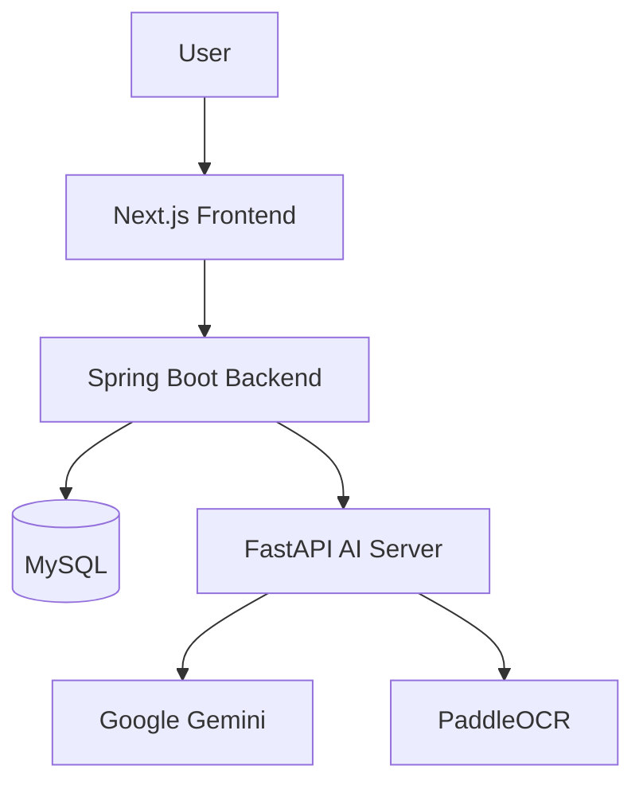
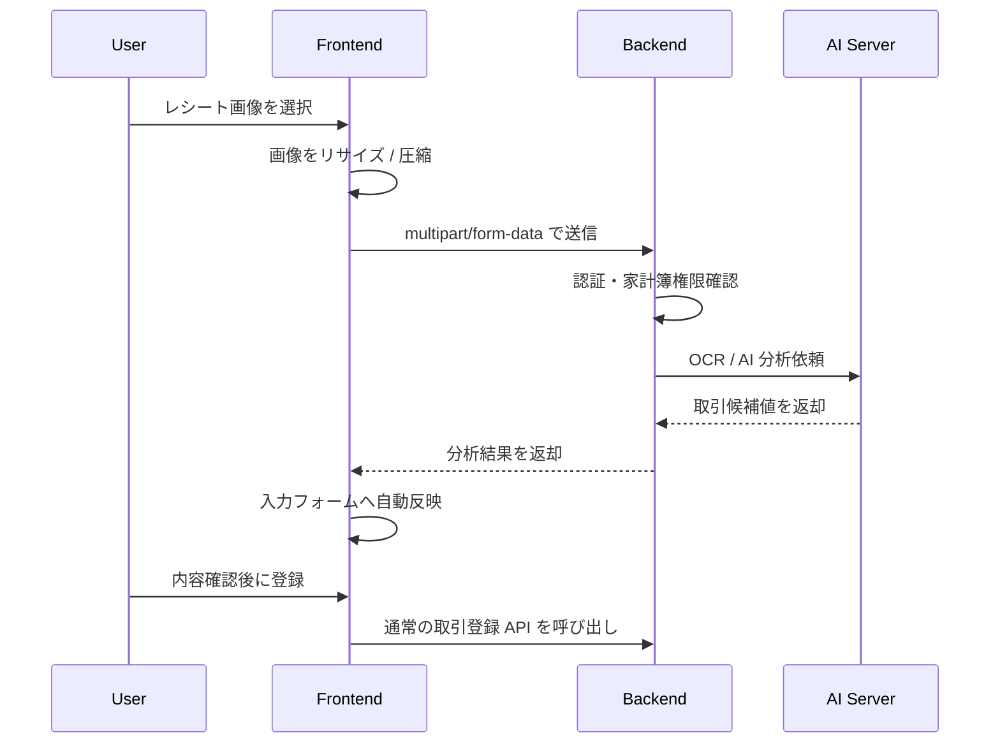

# TranslaCat Frontend

> Web小説閲覧・翻訳、音声翻訳、設定管理、家計簿を提供する Next.js ベースのフロントエンド

## 1. 概要

TranslaCat Frontend は、TranslaCat プラットフォームのユーザー向け UI を担当する Web アプリケーションです。
Google ソーシャルログインを起点に、Backend API と連携しながら、Web 小説閲覧、翻訳補助、音声翻訳、設定管理、家計簿機能を提供します。

本フロントエンドは、画面表示だけでなく、以下の役割も担います。

- Google ログインおよび NextAuth セッション管理
- Backend API への JWT 付きリクエスト送信
- 多言語 UI 表示
- ダークモード / ライトモード対応
- Web 小説系画面の表示
- 音声翻訳 UI
- 家計簿 UI
- レシート画像のアップロード前リサイズ / 圧縮
- AI レシート分析結果の入力フォーム反映

---

## 2. システム内での位置づけ



Frontend は原則として Backend のみを直接呼び出します。
AI Server は Backend 経由で利用し、Frontend から直接呼び出さない設計です。

---

## 3. 主な機能

### 3-1. 認証 / セッション

- Google ソーシャルログイン
- NextAuth によるセッション管理
- Backend から受け取った access token / refresh token の保持
- API 呼び出し時の Bearer token 付与
- 認証エラー時のログイン画面遷移

### 3-2. Web 小説系機能

- 小説プラットフォーム一覧表示
- ジャンル一覧表示
- ランキング表示
- 小説検索
- 小説詳細 / エピソード一覧表示
- エピソード本文表示
- 最近見た作品 / エピソード表示
- 辞書登録モーダル

### 3-3. 音声翻訳 UI

- 音声ファイル選択
- Backend 経由での音声翻訳処理呼び出し
- 文字起こし / 翻訳結果表示

### 3-4. 設定画面

- 設定トップ画面
- 一般設定
- 音声関連設定
- 小説関連設定
- チャット関連設定
- 家計簿設定
- 管理者向け通貨管理

### 3-5. 家計簿機能

家計簿機能では、個人またはグループ単位の支出・収入管理を行います。

- 家計簿作成
- 家計簿一覧表示
- 家計簿検索 / カテゴリ絞り込み
- 家計簿詳細表示
- 収入 / 支出サマリー
- 月別目標金額
- 固定費管理
- 取引登録 / 編集 / 削除
- 月別取引一覧
- カード表示 / テーブル表示切り替え
- カテゴリ別支出ランキング
- 店舗別支出ランキング
- 月別支出推移チャート
- メンバー管理 UI
- レシート画像 AI 分析による取引入力補助

---

## 4. AI レシート分析機能

取引登録モーダルでは、手入力に加えて「レシート分析」モードを提供します。
ユーザーがレシート画像を選択すると、Frontend は画像をリサイズ / 圧縮したうえで Backend へ送信します。



分析結果は即時保存されません。
必ず入力フォームへ反映し、ユーザーが内容を確認してから通常の取引登録 API で保存します。

自動反映対象:

- 取引名
- 店舗名
- 金額
- 取引日
- カテゴリ
- メモ

既存の店舗名またはカテゴリ名と一致する場合は select box の既存項目を自動選択します。
一致しない場合は直接入力モードに切り替えて候補値を入力します。

---

## 5. 技術スタック

| 区分 | 採用技術 |
|---|---|
| Framework | Next.js App Router |
| Language | TypeScript |
| UI | React, Tailwind CSS |
| Auth | NextAuth, Google Provider |
| i18n | next-intl |
| Data Fetching | SWR / custom hook |
| Charts | Recharts |
| Icons | lucide-react |
| API | Fetch API + custom apiClient |

---

## 6. API 呼び出し方針

API 呼び出しは `src/lib/apiClient.ts` を経由します。

- `NEXT_PUBLIC_API_URL` をベース URL として利用
- NextAuth session から access token を取得
- JSON リクエストでは `Content-Type: application/json` を自動付与
- `FormData` の場合はブラウザに Content-Type 生成を任せる
- `Authorization: Bearer {accessToken}` を付与
- 401 / 403 の場合はログアウト処理を行う

---

## 7. ディレクトリ構成

```text
src
├─ app
│  ├─ api/auth/[...nextauth]
│  └─ [locale]
│     ├─ (auth)
│     └─ (main)
│        ├─ account-books
│        ├─ novel
│        ├─ settings
│        └─ voice
├─ components
│  ├─ account-book
│  │  ├─ detail
│  │  │  ├─ fixed-cost
│  │  │  ├─ modal
│  │  │  │  └─ transaction-form
│  │  │  ├─ monthly-chart
│  │  │  ├─ ranking-chart
│  │  │  ├─ summary
│  │  │  └─ transaction-list
│  │  ├─ list
│  │  └─ modal
│  ├─ auth
│  ├─ common
│  ├─ layout
│  ├─ novel
│  ├─ settings
│  └─ voice
├─ hooks
├─ i18n
├─ lib
├─ services
├─ types
└─ utils
```

---

## 8. 家計簿フロントエンド構成

家計簿画面は、画面責務と UI 責務を分ける方針です。

### 8-1. 一覧画面

```text
app/[locale]/(main)/account-books/page.tsx
└─ components/account-book/list
   ├─ AccountBooksHeroSection
   ├─ AccountBooksContentSection
   └─ AccountBooksPageModals
```

### 8-2. 詳細画面

```text
app/[locale]/(main)/account-books/[accountBookId]/page.tsx
└─ components/account-book/detail
   ├─ AccountBookDetailHeader
   ├─ AccountBookDetailSummarySmartSection
   ├─ AccountBookTransactionSmartSection
   ├─ AccountBookFixedCostSmartSection
   ├─ MonthlyExpenseChart
   └─ ExpenseRankingChart
```

### 8-3. 取引登録モーダル

`TransactionFormModal` は smart component + hook + presentational components に分離しています。

```text
modal/TransactionFormModal.tsx
└─ modal/transaction-form
   ├─ useTransactionFormModal.ts
   ├─ ReceiptAnalysisPanel.tsx
   ├─ TransactionInputModeTabs.tsx
   ├─ TransactionTypeSelector.tsx
   ├─ TransactionFormFields.tsx
   ├─ TransactionFormActions.tsx
   ├─ constants.ts
   ├─ types.ts
   └─ utils.ts
```

---

## 9. 主要サービス

```text
services/account-book
├─ accountBookService.ts
├─ accountBookCategoryService.ts
├─ accountBookChartService.ts
├─ accountBookFixedCostService.ts
├─ accountBookMemberService.ts
├─ accountBookMonthlyGoalService.ts
└─ accountBookTransactionService.ts
```

`accountBookTransactionService.analyzeReceipt()` は、レシート画像を圧縮したうえで Backend のレシート分析 API を呼び出します。

---

## 10. 環境変数

代表的な環境変数は以下です。

| 項目 | 用途 |
|---|---|
| `NEXT_PUBLIC_API_URL` | Backend API のベース URL |
| `NEXTAUTH_URL` | NextAuth のアプリ URL |
| `NEXTAUTH_SECRET` | NextAuth secret |
| `GOOGLE_CLIENT_ID` | Google OAuth client id |
| `GOOGLE_CLIENT_SECRET` | Google OAuth client secret |

例:

```env
NEXT_PUBLIC_API_URL=http://localhost:8080/api/v1
NEXTAUTH_URL=http://localhost:3000
NEXTAUTH_SECRET=your-nextauth-secret
GOOGLE_CLIENT_ID=your-google-client-id
GOOGLE_CLIENT_SECRET=your-google-client-secret
```

---

## 11. ローカル実行

```bash
npm install
npm run dev
```

ビルド:

```bash
npm run lint
npm run build
```

---

## 12. 開発時の注意点

- Frontend は AI Server を直接呼び出しません。
- API 呼び出しには Backend から発行された JWT が必要です。
- `FormData` 送信時は `Content-Type` を手動設定しないようにします。
- レシート画像は Backend / AI Server のサイズ制限に合わせ、Frontend で圧縮してから送信します。
- 家計簿の金額表示は通貨コードに応じてフォーマットします。
- 多言語文言は `messages` 配下で管理します。

---

## 13. まとめ

TranslaCat Frontend は、翻訳・閲覧・音声・家計簿を統合するユーザー向け Web UI です。
Backend を API Hub として利用し、認証情報を安全に扱いながら、AI Server の処理結果も画面体験へ自然に組み込む構成になっています。
