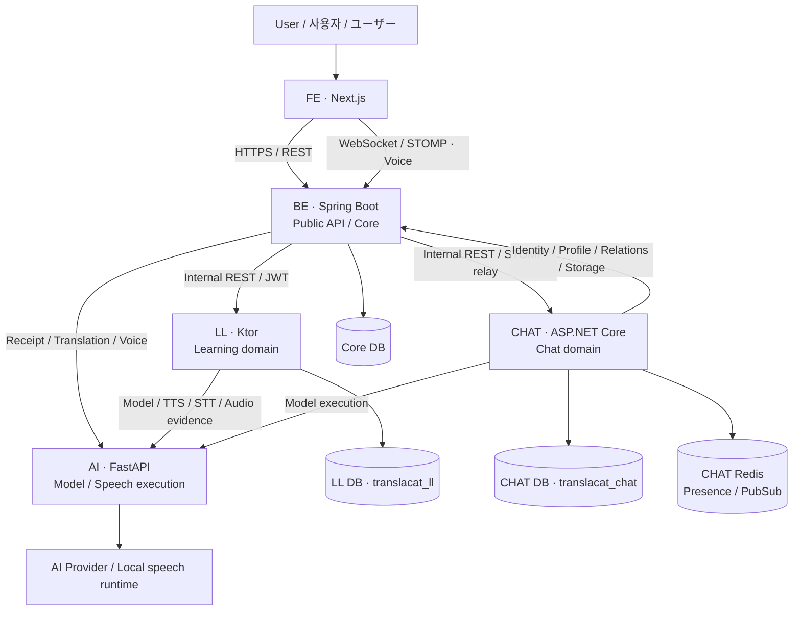
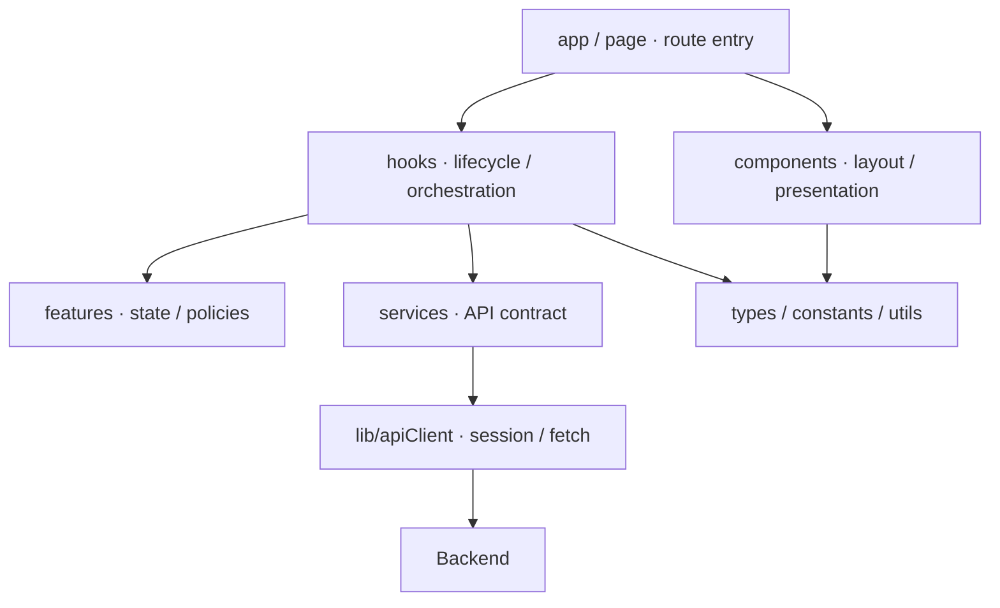
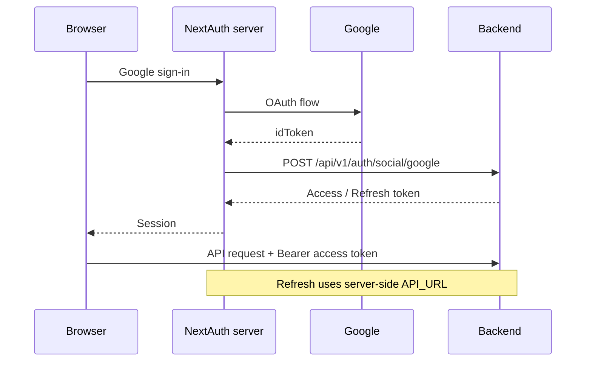
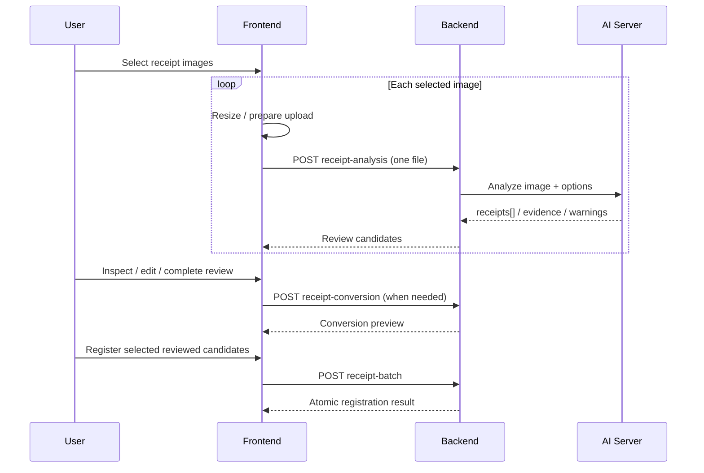

# TranslaCat Frontend

> 언어학습·채팅·음성 번역·가계부·관리자 소설 기능을 통합하는 Next.js 사용자 인터페이스  
> 言語学習・チャット・音声翻訳・家計簿・管理者向け小説機能を統合するNext.jsユーザーインターフェース

TranslaCat의 FE / BE / AI / CHAT / LL 분리 구조를 설명하는 저장소 안내서입니다. 기술 버전과 경로는 2026-09-27 제공 소스 기준이며, 실행 환경의 실제 배포 상태나 테스트 통과를 의미하지 않습니다.  
TranslaCatのFE / BE / AI / CHAT / LL分離構成を説明するリポジトリガイドです。技術バージョンとパスは2026-09-27提供ソースを基準とし、実環境でのデプロイ状態やテスト成功を示すものではありません。

[개요 / 概要](#overview) · [구조 / 構成](#architecture) · [실행 / 起動](#setup) · [환경변수 / 環境変数](#configuration) · [테스트 / テスト](#tests) · [문제 해결 / トラブル対応](#troubleshooting)

---

<a id="overview"></a>

## 1. 개요 / 概要

TranslaCat Frontend는 여러 서비스를 하나의 로그인·다국어 UI로 연결하는 웹 애플리케이션입니다. 화면별 데이터 요청, 사용자 입력, 진행 중 작업의 상태, 오디오 재생·녹음, WebSocket 이벤트를 사용자 경험으로 연결합니다.  
TranslaCat Frontendは複数のサービスを一つのログイン・多言語UIに結び付けるWebアプリケーションです。画面ごとのデータ取得、ユーザー入力、処理中の状態、音声再生・録音、WebSocketイベントを利用体験へつなぎます。

기존 README의 가계부·화면 분리 설명을 유지하면서, 현재 소스에 있는 언어학습·채팅·Voice V2·다중 영수증 검토 흐름을 함께 설명합니다. 소설 관련 화면은 일반 공개 기능이 아니라 관리자 접근 제어가 적용된 영역입니다.  
従来のREADMEにあった家計簿・画面分離の説明を維持しつつ、現在のソースにある言語学習・チャット・Voice V2・複数レシート確認フローを説明します。小説関連画面は一般公開機能ではなく、管理者アクセス制御の対象です。

---

<a id="architecture"></a>

## 2. 시스템에서의 위치 / システム内での位置付け


```mermaid
flowchart TB
    U["User / 사용자 / ユーザー"] --> FE["FE · Next.js"]
    FE -->|"HTTPS / REST"| BE["BE · Spring Boot<br/>Public API / Core"]
    FE -->|"WebSocket / STOMP · Voice"| BE
    BE -->|"Internal REST / JWT"| LL["LL · Ktor<br/>Learning domain"]
    BE -->|"Internal REST / STOMP relay"| CHAT["CHAT · ASP.NET Core<br/>Chat domain"]
    CHAT -->|"Identity / Profile / Relations / Storage"| BE
    BE -->|"Receipt / Translation / Voice"| AI["AI · FastAPI<br/>Model / Speech execution"]
    LL -->|"Model / TTS / STT / Audio evidence"| AI
    CHAT -->|"Model execution"| AI
    BE --> COREDB[("Core DB")]
    LL --> LLDB[("LL DB · translacat_ll")]
    CHAT --> CHATDB[("CHAT DB · translacat_chat")]
    CHAT --> REDIS[("CHAT Redis<br/>Presence / PubSub")]
    AI --> PROVIDER["AI Provider / Local speech runtime"]
```

DB 상자는 데이터 책임과 논리 catalog를 나타냅니다. 이 그림만으로 서로 다른 물리 DB 서버·배포 호스트·고가용성 구성을 의미하지 않습니다. Storage 및 인증 공급자의 세부 연결은 각 기능 절에서 설명합니다.  
DBの箱はデータ責務と論理catalogを表します。この図だけで別々の物理DBサーバー・配置ホスト・高可用性構成を意味するものではありません。Storageと認証プロバイダーの詳細接続は各機能節で説明します。

일반 업무 REST 요청과 기본 채팅 WebSocket 연결 대상은 BE입니다. LL 및 CHAT으로의 분배는 BE가 수행하고, FE에 내부 서비스 키나 AI Provider API 키를 넣지 않습니다. 발급받은 업로드 URL을 사용하는 음성·이미지 저장 흐름은 개별 API 계약을 따릅니다.  
通常の業務RESTリクエストと標準のチャットWebSocket接続先はBEです。LLとCHATへの振り分けはBEが行い、FEには内部サービスキーやAI Provider APIキーを配置しません。発行されたアップロードURLを使う音声・画像保存フローは各API契約に従います。

| 영역 / 領域 | FE의 책임 / FEの責務 | 서버의 책임 / サーバーの責務 |
| --- | --- | --- |
| 인증 / 認証 | NextAuth 세션·로그인 UI·Bearer 전달<br/>NextAuthセッション・ログインUI・Bearer付与 | BE의 사용자 확인·JWT 발급·최종 권한<br/>BEでのユーザー確認・JWT発行・最終認可 |
| 언어학습 / 言語学習 | 문제·녹음·답안·결과·재진입 UI<br/>問題・録音・回答・結果・再開UI | LL의 학습 상태·채점·복구·저장<br/>LLの学習状態・採点・復旧・保存 |
| 채팅 / チャット | 메시지 표시·전송·읽음·실시간 반영<br/>メッセージ表示・送信・既読・リアルタイム反映 | CHAT의 멤버 권한·영속화·번역·AI 정책<br/>CHATのメンバー認可・永続化・翻訳・AI方針 |
| 가계부 / 家計簿 | 거래 입력·분석 후보 확인·수정<br/>取引入力・分析候補の確認・修正 | BE의 소유권·환율·금액 검증·등록<br/>BEの所有権・為替・金額検証・登録 |

**관련 소스 / 関連ソース:** [API client](src/lib/apiClient.ts) · [Chat WebSocket](src/utils/websocket.ts) · [Voice URL](src/features/voice/stream/voiceWebSocketUrl.ts)

---

## 3. 기술 스택 / 技術スタック

| 구분 / 区分 | 선언된 기술 / 宣言された技術 |
| --- | --- |
| Runtime | Node.js 22 계열 Docker image / Node.js 22系Docker image |
| Framework | Next.js 16.3.6 · App Router · standalone output |
| UI / Language | React 19.2.3 · TypeScript 5.9.3 · Tailwind CSS 4 |
| Authentication | NextAuth 4.24.15 · Google Provider |
| i18n / Theme | next-intl · next-themes |
| Data | SWR · TanStack React Query · Fetch API |
| Realtime | @stomp/stompjs · WebSocket |
| Visuals | Recharts · lucide-react · Noto Sans JP |
| Verification | ESLint · TypeScript · Node test runner · Playwright |

정확한 설치 의존성은 `package-lock.json`을 사용합니다. 표의 버전은 저장소 선언값이며 최신 버전 추천이나 업그레이드 지시가 아닙니다.  
正確なインストール依存関係には`package-lock.json`を使用します。表のバージョンはリポジトリの宣言値であり、最新版の推奨やアップグレード指示ではありません。

**관련 소스 / 関連ソース:** [package.json](package.json) · [lockfile](package-lock.json) · [Next config](next.config.ts) · [Dockerfile](Dockerfile)

---

## 4. 주요 기능 / 主な機能

### 인증·공통 UI / 認証・共通UI

Google 로그인, 세션 유지와 토큰 갱신, 보호된 화면 이동, 사용자 프로필과 이미지, 친구 요청·검색·차단, 알림, 테마 전환을 제공합니다. 인증 만료와 일시적인 인증 서버 장애를 구분합니다.  
Googleログイン、セッション維持とトークン更新、保護画面への遷移、プロフィールと画像、友達リクエスト・検索・ブロック、通知、テーマ切り替えを提供します。認証期限切れと認証サーバーの一時障害を区別します。

### 언어학습 / 言語学習

Level Test, Daily Writing, Listening, Speaking, Reading, Vocabulary 및 Dashboard·History·Profile·Settings 화면을 제공합니다. 생성·오디오 준비·평가·실패·재시도 상태를 표시하며, 학습 판정 자체는 LL 응답을 따릅니다.  
Level Test、Daily Writing、Listening、Speaking、Reading、VocabularyとDashboard・History・Profile・Settings画面を提供します。生成・音声準備・評価・失敗・再試行の状態を表示し、学習判定自体はLLの応答に従います。

### 채팅·소셜 / チャット・ソーシャル

친구 1:1·그룹 채팅, 오픈 채팅 탐색·입장·프로필·운영, 메시지 이력과 실시간 수신, 읽음 상태, 번역 결과와 재시도, AI 멤버 설정을 제공합니다. STOMP 이벤트와 REST 조회 결과를 조합해 화면 상태를 갱신합니다.  
友達との1対1・グループチャット、オープンチャットの検索・参加・プロフィール・運営、メッセージ履歴とリアルタイム受信、既読状態、翻訳結果と再試行、AIメンバー設定を提供します。STOMPイベントとREST取得結果を組み合わせて画面状態を更新します。

### Voice Translation V2 / Voice Translation V2

실시간 음성 세션 설정, 채널별 오디오 수집과 스트리밍, 부분·최종 인식문, 번역 결과, 세션 이력을 제공합니다. 녹음 및 오디오 전송 로직은 `features/voice`에 분리되어 있습니다.  
リアルタイム音声セッション設定、チャンネル別音声取得とストリーミング、部分・最終認識文、翻訳結果、セッション履歴を提供します。録音と音声送信ロジックは`features/voice`に分離しています。

### 가계부·영수증 검토 / 家計簿・レシート確認

가계부·멤버·초대·카테고리·수입/지출·고정비·월별 목표·차트를 제공합니다. 영수증은 여러 이미지 선택과 이미지 안의 복수 후보를 검토하는 흐름을 갖고, 표/카드 표시·금액/카테고리 수정·원본/영역 확인·검토 완료 후 일괄 등록을 지원합니다.  
家計簿・メンバー・招待・カテゴリ・収入/支出・固定費・月別目標・チャートを提供します。レシートには複数画像の選択と画像内の複数候補を確認するフローがあり、表/カード表示・金額/カテゴリ修正・原本/領域確認・確認完了後の一括登録をサポートします。

### 관리자 기능 / 管理者機能

통화·영수증 AI 설정·언어학습·채팅 AI 설정과 관리자 소설 영역을 제공합니다. UI 비표시만으로 보안을 보장하지 않으며, 서버의 권한 검증이 최종 기준입니다.  
通貨・レシートAI設定・言語学習・チャットAI設定と管理者向け小説領域を提供します。UIの非表示だけでセキュリティを保証せず、サーバー側の認可を最終基準とします。

**관련 소스 / 関連ソース:** [Screens](src/app) · [Learning](src/features/language-learning) · [Chat hooks](src/hooks/chat) · [Receipt review](src/hooks/account-book/detail/receipt/useReceiptReview.ts)

---

## 5. 화면과 로직의 분리 / 画面とロジックの分離


```mermaid
flowchart TD
    PAGE["app / page · route entry"] --> UI["components · layout / presentation"]
    PAGE --> HOOK["hooks · lifecycle / orchestration"]
    HOOK --> FEATURE["features · state / policies"]
    HOOK --> SERVICE["services · API contract"]
    SERVICE --> CLIENT["lib/apiClient · session / fetch"]
    CLIENT --> BE["Backend"]
    UI --> TYPES["types / constants / utils"]
    HOOK --> TYPES
```

페이지는 화면 진입과 조립, Component는 표현, Hook은 비동기 상태와 상호작용, Service는 API 계약을 담당하는 방향으로 구성되어 있습니다. 모든 파일이 동일한 단일 패턴으로 강제되어 있는 것은 아니며, 기능별 `features`와 기존 `hooks/components` 구조가 함께 존재합니다.  
ページは画面入口と組み立て、Componentは表示、Hookは非同期状態と操作、ServiceはAPI契約を担う方向で構成されています。全ファイルが一つのパターンに統一されているわけではなく、機能別の`features`と既存の`hooks/components`構成が共存しています。

가계부는 목록·상세·거래 모달을 분리하고, 영수증 검토 상태를 일반 수입/지출 입력 상태와 구분합니다. 언어학습은 생성 상태·오디오·문항 진행을 기능 모듈과 Hook에서 관리하여 화면 컴포넌트의 책임을 줄입니다.  
家計簿では一覧・詳細・取引モーダルを分離し、レシート確認状態を通常の収入/支出入力状態と区別します。言語学習では生成状態・音声・問題進行を機能モジュールとHookで扱い、画面コンポーネントの責務を小さくします。

**관련 소스 / 関連ソース:** [Account-book UI](src/components/account-book) · [Learning hooks](src/hooks/language-learning) · [Structure checker](scripts/check-fe-structure.mjs)

---

## 6. 인증과 API 호출 / 認証とAPI呼び出し


```mermaid
sequenceDiagram
    participant B as Browser
    participant N as NextAuth server
    participant G as Google
    participant BE as Backend
    B->>N: Google sign-in
    N->>G: OAuth flow
    G-->>N: idToken
    N->>BE: POST /api/v1/auth/social/google
    BE-->>N: Access / Refresh token
    N-->>B: Session
    B->>BE: API request + Bearer access token
    Note over N,BE: Refresh uses server-side API_URL
```

`src/services/authService.ts`는 서버에서 `API_URL`을 사용하고, `src/lib/apiClient.ts`는 브라우저에서 `NEXT_PUBLIC_API_URL`을 사용합니다. 로컬에서는 두 값이 같을 수 있지만, 서버와 브라우저의 접근 가능한 주소가 다르면 각 실행 위치에 맞게 설정해야 합니다.  
`src/services/authService.ts`はサーバー側で`API_URL`を、`src/lib/apiClient.ts`はブラウザー側で`NEXT_PUBLIC_API_URL`を使います。ローカルでは同じ値でも構いませんが、サーバーとブラウザーから到達できるアドレスが異なる場合は実行場所に合わせて設定します。

JSON 요청에는 Content-Type을 붙이고, `FormData`는 브라우저가 multipart boundary를 생성하도록 맡깁니다. 실제 API 응답의 `401`은 인증 오류 이벤트로 연결하지만, 모든 `403`을 자동 로그아웃으로 처리하지는 않습니다. 일시적인 토큰 갱신 실패로 유효 토큰이 없으면 로컬 `503`과 `Retry-After`를 반환합니다.  
JSONリクエストにはContent-Typeを付与し、`FormData`ではブラウザーにmultipart boundary生成を任せます。実APIの`401`は認証エラーイベントにつなげますが、すべての`403`を自動ログアウトにはしません。一時的なトークン更新失敗で有効トークンがない場合はローカル`503`と`Retry-After`を返します。

**관련 소스 / 関連ソース:** [NextAuth](src/lib/auth.ts) · [Server auth API](src/services/authService.ts) · [Client API](src/lib/apiClient.ts) · [Auth errors](src/lib/authError.ts)

---

## 7. 실시간 통신과 영수증 흐름 / リアルタイム通信とレシートフロー

### 채팅 / Voice 연결 / チャット / Voice接続

채팅 주소는 `NEXT_PUBLIC_WS_URL`이 있으면 이를 사용하고, 없으면 `NEXT_PUBLIC_API_URL`에서 `/api/v1`을 제거하고 `/ws/chat`을 붙입니다. 기본 경로는 BE의 STOMP relay입니다. Voice는 세션·채널별 ticket을 받은 뒤 `/api/v1/voice/sessions/{sessionId}/channels/{channel}/stream`에 연결합니다.  
チャット接続先は`NEXT_PUBLIC_WS_URL`があればその値を使い、なければ`NEXT_PUBLIC_API_URL`から`/api/v1`を除いて`/ws/chat`を付けます。標準経路はBEのSTOMP relayです。Voiceはセッション・チャンネル別ticketを取得し、`/api/v1/voice/sessions/{sessionId}/channels/{channel}/stream`へ接続します。

### 분석과 저장의 분리 / 分析と保存の分離


```mermaid
sequenceDiagram
    participant U as User
    participant FE as Frontend
    participant BE as Backend
    participant AI as AI Server
    U->>FE: Select receipt images
    loop Each selected image
        FE->>FE: Resize / prepare upload
        FE->>BE: POST receipt-analysis (one file)
        BE->>AI: Analyze image + options
        AI-->>BE: receipts[] / evidence / warnings
        BE-->>FE: Review candidates
    end
    U->>FE: Inspect / edit / complete review
    FE->>BE: POST receipt-conversion (when needed)
    BE-->>FE: Conversion preview
    U->>FE: Register selected reviewed candidates
    FE->>BE: POST receipt-batch
    BE-->>FE: Atomic registration result
```

도식의 반복은 이미지별 API 단위를 표현하며 직렬 실행을 뜻하지 않습니다. 현재 분석 API는 `file` 하나를 보내고, 다중 이미지의 상태·취소·동시 요청은 FE의 분석 관리 흐름에서 다룹니다. AI 분석 결과를 받은 시점과 거래가 저장된 시점은 다릅니다.  
図の繰り返しは画像ごとのAPI単位を表し、直列実行を意味しません。現在の分析APIは一つの`file`を送り、複数画像の状態・キャンセル・同時リクエストはFEの分析管理フローが扱います。AI分析結果を受け取った時点と取引が保存された時点は異なります。

**관련 소스 / 関連ソース:** [Receipt API](src/services/account-book/accountBookTransactionService.ts) · [Receipt review logic](src/utils/account-book/receipt-review) · [Chat realtime](src/hooks/chat/useChatRoomWebSocket.ts)

---

## 8. 다국어와 화면 경로 / 多言語と画面パス

UI locale은 `ko`, `ja`, `learning`을 정의합니다. `learning`은 별도 학습 모드 locale이며 새로운 자연어 코드를 의미하지 않습니다. `src/proxy.ts`는 `localePrefix: "always"`를 사용하므로 문서와 테스트에서도 locale이 붙은 URL을 기준으로 합니다.  
UI localeには`ko`、`ja`、`learning`を定義しています。`learning`は学習モード用localeであり、新たな自然言語コードではありません。`src/proxy.ts`は`localePrefix: "always"`を使用するため、文書とテストでもlocale付きURLを基準にします。

| 대표 경로 / 代表パス | 화면 / 画面 |
| --- | --- |
| `/{locale}/login` | 로그인 / ログイン |
| `/{locale}/language-learning` | 학습 Dashboard / 学習Dashboard |
| `/{locale}/language-learning/{writing,listening,speaking,reading,vocabulary}` | 기능별 학습 화면; 중괄호는 목록 표기<br/>各学習画面。波括弧は候補の列挙 |
| `/{locale}/chat` · `/{locale}/chat/rooms/{roomId}` | 채팅 목록·대화방 / チャット一覧・ルーム |
| `/{locale}/chat/open` | 오픈 채팅 탐색 / オープンチャット検索 |
| `/{locale}/friends` | 친구·관계 / 友達・関係 |
| `/{locale}/account-books` | 가계부 / 家計簿 |
| `/{locale}/voice` | 실시간 음성 번역 / リアルタイム音声翻訳 |
| `/{locale}/settings/admin/*` · `/{locale}/novel` | 관리자 영역 / 管理者領域 |

**관련 소스 / 関連ソース:** [Locales](src/i18n/config.ts) · [Routing protection](src/proxy.ts) · [Messages](messages) · [Routes](src/app)

---

## 9. 디렉터리 구조 / ディレクトリ構成

```text
.
├─ src/
│  ├─ app/                  # App Router / API auth
│  ├─ components/           # Account-book / Chat / Learning / Voice / Common UI
│  ├─ features/             # Learning / Voice state and execution logic
│  ├─ hooks/                # Feature orchestration and reusable hooks
│  ├─ services/             # Backend API adapters
│  ├─ lib/                  # Auth / API client / shared infrastructure
│  ├─ types/                # API and UI contracts
│  ├─ constants/            # Routes / feature constants
│  ├─ utils/                # Feature utilities / WebSocket URLs
│  ├─ i18n/                 # Locale configuration
│  └─ proxy.ts              # Authentication and locale routing
├─ messages/                # Translation resources
├─ public/                  # Static resources / audio workers
├─ tests/                   # Node-based unit tests
├─ e2e/                     # Mock and integration browser tests
├─ scripts/                 # Structure / i18n / E2E helpers
├─ playwright.config.ts
├─ next.config.ts
├─ package.json
└─ Dockerfile
```

---

<a id="setup"></a>

## 10. 로컬 실행 / ローカル起動

저장소 루트에서 Node.js와 npm을 준비한 뒤 lockfile 기준으로 설치합니다. Google 로그인이 필요한 화면은 BE와 OAuth 설정까지 준비되어야 합니다.  
リポジトリルートでNode.jsとnpmを用意し、lockfileに基づいてインストールします。Googleログインが必要な画面ではBEとOAuth設定も必要です。

```powershell
node --version
npm --version
npm ci
# .env.local을 아래 표와 예시에 맞춰 준비 / 下記の表と例に従って.env.localを準備
npm run dev
```

로컬 확인 주소 예시는 `http://localhost:3000/ko/login`입니다. 동일한 명령은 Bash에서도 사용할 수 있습니다. 운영 빌드 실행은 개발 서버와 구분합니다.  
ローカル確認URLの例は`http://localhost:3000/ko/login`です。同じコマンドはBashでも利用できます。本番ビルドの起動は開発サーバーと区別します。

```bash
npm run build
npm run start
```

---

<a id="configuration"></a>

## 11. 환경변수와 배포 설정 / 環境変数と配置設定

| 변수 / 変数 | 사용 위치 / 使用場所 | 용도 / 用途 |
| --- | --- | --- |
| `API_URL` | NextAuth server | Google 인증·토큰 갱신용 BE API base; `/api/v1` 포함<br/>Google認証・トークン更新用BE API base。`/api/v1`を含む |
| `NEXT_PUBLIC_API_URL` | Browser / build | 업무 REST API base; `/api/v1` 포함<br/>業務REST API base。`/api/v1`を含む |
| `NEXTAUTH_URL` | NextAuth server | FE의 기준 origin / FEの基準origin |
| `NEXTAUTH_SECRET` | Server secret | NextAuth secret; 공개 변수에 저장 금지<br/>NextAuth secret。公開変数への保存禁止 |
| `GOOGLE_CLIENT_ID` · `GOOGLE_CLIENT_SECRET` | Server | Google OAuth 설정 / Google OAuth設定 |
| `NEXT_PUBLIC_WS_URL` | Browser / build | 선택적 채팅 WebSocket 전체 주소<br/>任意のチャットWebSocket完全URL |
| `NEXT_PUBLIC_SITE_URL` | Build / layout | 페이지 metadata 기준 URL<br/>ページmetadataの基準URL |
| `NEXT_PUBLIC_RECEIPT_REVIEW_ASSISTED` | Browser / build | 문자열 `true`일 때 검토 지원 활성화<br/>文字列`true`で確認支援を有効化 |
| `NEXT_DIST_DIR` | Next config | 선택적 격리 빌드 경로; 기본 `.next`<br/>任意の分離ビルド先。既定`.next` |

```dotenv
# .env.local — 예시이며 비밀값은 직접 준비 / 例。秘密値は別途用意
API_URL=http://localhost:8080/api/v1
NEXT_PUBLIC_API_URL=http://localhost:8080/api/v1
NEXTAUTH_URL=http://localhost:3000
NEXT_PUBLIC_SITE_URL=http://localhost:3000
NEXTAUTH_SECRET=<set-a-private-secret>
GOOGLE_CLIENT_ID=<google-client-id>
GOOGLE_CLIENT_SECRET=<google-client-secret>
NEXT_PUBLIC_RECEIPT_REVIEW_ASSISTED=true
# NEXT_PUBLIC_WS_URL=ws://localhost:8080/ws/chat
```

검토 지원 플래그는 FE Hook에서 정확히 `"true"`인지 확인하므로 미지정은 비활성입니다. 반면 첨부 Dockerfile의 build argument 기본값은 `true`입니다. 로컬·Vercel·Docker에서 의도한 값을 명시해 차이를 방지합니다.  
確認支援フラグはFE Hookで厳密に`"true"`かを確認するため、未指定は無効です。一方、提供Dockerfileのbuild argumentの既定値は`true`です。ローカル・Vercel・Dockerで意図した値を明示し、差異を防ぎます。

Dockerfile은 standalone 빌드와 non-root 실행을 사용합니다. 현재 `NEXT_PUBLIC_WS_URL`은 Docker build argument로 선언되어 있지 않으므로 환경변수를 적었다는 이유만으로 이미지에 반영되었다고 가정하지 않습니다. 모든 공개 변수의 실제 빌드 주입 경로를 확인하고, 서버용 secret은 실행 환경에서 공급합니다.  
Dockerfileはstandaloneビルドとnon-root実行を使用します。現在`NEXT_PUBLIC_WS_URL`はDocker build argumentとして宣言されていないため、環境変数を書いただけでイメージに反映されたとは見なしません。公開変数の実際のビルド注入経路を確認し、サーバー用secretは実行環境で供給します。

**관련 소스 / 関連ソース:** [Docker build args](Dockerfile) · [Auth service](src/services/authService.ts) · [Receipt flag](src/hooks/account-book/detail/receipt/useReceiptReview.ts) · [Git ignore](.gitignore)

---

<a id="tests"></a>

## 12. 검증과 테스트 / 検証とテスト

```bash
npm run lint
npm run typecheck
npm run check:i18n
npm run check:structure
npm run test:unit
npm run test:generation
npm run build
```

| 테스트 / テスト | 명령 / コマンド | 범위와 조건 / 範囲と条件 |
| --- | --- | --- |
| Mock E2E | `npm run test:e2e` | `mock-chromium`; 실제 BE/DB 통합 증거가 아님<br/>`mock-chromium`。実BE/DB結合の証拠ではない |
| 핵심 UI gate / 主要UI gate | `npm run test:e2e:gate` | 지정된 사회/친구/방/메시지 케이스<br/>指定されたsocial/友達/ルーム/メッセージケース |
| 화면 표시 / ブラウザー表示 | `npm run test:e2e:headed` | 브라우저 창에서 Mock 실행<br/>ブラウザー表示でMock実行 |
| 전체 프로젝트 / 全project | `npm run test:e2e:all` | Mock + Integration; 통합 환경 필요<br/>Mock + Integration。結合環境が必要 |
| 실결합 / 実結合 | `npm run test:e2e:integration` | 실제 테스트 계정·BE와 하위 서비스 필요<br/>実テストアカウント・BEと下位サービスが必要 |
| 결과 / 結果 | `npm run test:e2e:report` | HTML report 조회 / HTML report表示 |

브라우저가 없으면 `npx playwright install chromium`으로 테스트 브라우저를 준비합니다. Playwright 설정은 `.env.e2e.local`, `.env.local` 순서로 읽고 이미 존재하는 process 환경변수는 덮어쓰지 않습니다. 기본 URL은 `http://localhost:3000`, 외부 서버 재사용은 `PLAYWRIGHT_SKIP_WEB_SERVER=1`입니다.  
ブラウザーがなければ`npx playwright install chromium`でテストブラウザーを準備します。Playwright設定は`.env.e2e.local`、`.env.local`の順で読み、既存のprocess環境変数を上書きしません。既定URLは`http://localhost:3000`、外部サーバー利用は`PLAYWRIGHT_SKIP_WEB_SERVER=1`です。

실결합 테스트는 계정·관계·채팅 등 서버 데이터를 변경할 수 있으므로 전용 테스트 계정을 사용합니다. 저장된 인증 state에는 cookie/token이 포함될 수 있으므로 Git에 넣지 않습니다. 과거 매뉴얼의 테스트 개수는 현재 성공 개수로 재사용하지 않습니다.  
実結合テストはアカウント・関係・チャット等のサーバーデータを変更し得るため、専用テストアカウントを使用します。保存された認証stateにはcookie/tokenが含まれ得るためGitに含めません。過去マニュアルのテスト件数を現在の成功件数として再利用しません。

**관련 소스 / 関連ソース:** [Playwright config](playwright.config.ts) · [E2E manual](PLAYWRIGHT_E2E_TEST_MANUAL_README.md) · [Integration launcher](scripts/run-integration-e2e.mjs)

---

<a id="troubleshooting"></a>

## 13. 문제 해결 / トラブル対応

| 증상 / 症状 | 확인 사항 / 確認事項 |
| --- | --- |
| Google 로그인 실패 / Googleログイン失敗 | `API_URL`·OAuth client·BE 인증 응답 확인. 공개 API URL만 설정했는지 확인<br/>`API_URL`・OAuth client・BE認証応答を確認。公開API URLだけ設定していないか確認 |
| API 401 / 일시적 503 / 一時的503 | 세션 만료와 refresh 일시 장애를 구분<br/>セッション期限切れとrefresh一時障害を区別 |
| 403 또는 관리자 화면 접근 불가<br/>403または管理者画面にアクセス不可 | 서버 권한·사용자 역할 확인; UI에서 우회하지 않음<br/>サーバー認可・ユーザーroleを確認。UIで迂回しない |
| 채팅 실시간 연결 실패 / チャット接続失敗 | BE `/ws/chat`, CHAT ingress/Origin, proxy Upgrade, TLS, 토큰 확인<br/>BE `/ws/chat`、CHAT ingress/Origin、proxy Upgrade、TLS、tokenを確認 |
| 학습 생성/평가가 멈춤 / 学習生成・評価が停止 | BE→LL→AI 상태와 문항/세션 ID를 함께 확인<br/>BE→LL→AI状態と問題/セッションIDを併せて確認 |
| 영수증 UI가 환경마다 다름 / レシートUIが環境ごとに異なる | 빌드 시 review flag와 사용 중인 image/runtime 확인<br/>ビルド時review flagと使用image/runtimeを確認 |
| 녹음 불가 / 録音不可 | 브라우저 권한·입력 장치·페이지 보안 컨텍스트와 Voice/학습 API 확인<br/>ブラウザー権限・入力装置・ページのセキュリティcontextとVoice/学習APIを確認 |

---

## 14. 문서와 유지보수 기준 / 文書と保守の基準

화면 기능은 `src/app`, API 계약은 `src/services`, 의존성과 실행 명령은 `package.json`, 실시간 프로토콜은 각 WebSocket Hook을 함께 확인합니다. README는 주요 경로를 설명하며 모든 API·화면 상태·테스트 케이스의 전체 목록을 대신하지 않습니다.  
画面機能は`src/app`、API契約は`src/services`、依存関係と実行コマンドは`package.json`、リアルタイムprotocolは各WebSocket Hookを併せて確認します。READMEは主要経路を説明するもので、すべてのAPI・画面状態・テストケース一覧の代わりではありません。
